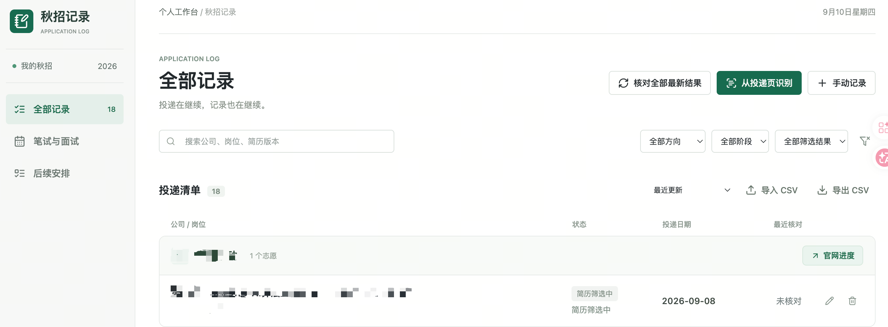
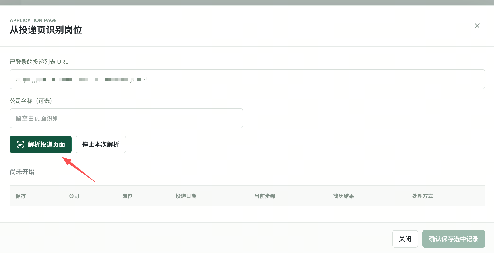
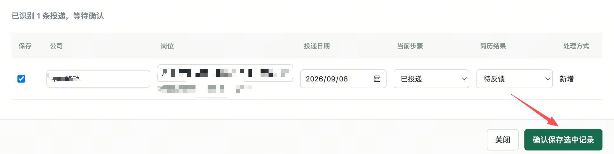
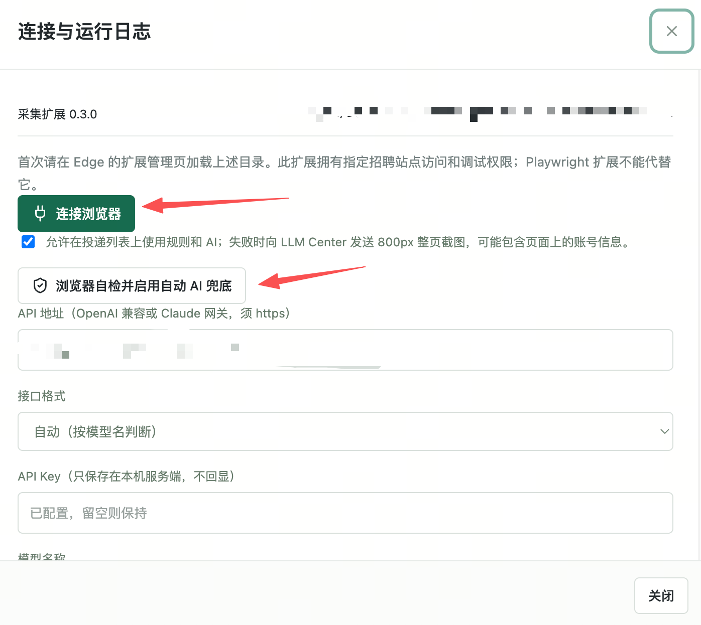

# 秋招记录小助手

一个跑在自己电脑上的秋招投递台账。中文界面，数据只存本地，不依赖任何云服务；AI 是可选项，用你自己的接口。

主要功能：

- 记录每一次投递的公司、岗位、志愿（第 1/2/3 志愿或人才计划）、方向、地点、投递日期、简历筛选结果和当前步骤。
- 同一家公司归为一条展示，下面分列各志愿，不再一条投递一行。
- 「笔试与面试」是月/周日历，可记录笔试、多轮面试和下一步安排。
- 从招聘网站一键识别：登录好官网，把“我的投递/应聘记录”的网址填进来，自动读出多个岗位和状态；规则看不清时用 AI 兜底（会先征得同意）。
- 每条记录都能单独核对，也可以一键核对全部（最多并发 8 条）。
- 支持 CSV 导入导出、按日期/公司/状态排序、本地历史版本快照。
- 可自定义 AI 接入：OpenAI 兼容接口或 Claude `/messages` 接口，地址、密钥、模型都由你填。

## 界面预览






## 需要准备

- 一台 macOS 电脑（Windows/Linux 也可，命令行启动即可）。
- [Node.js](https://nodejs.org/) 22 或以上。
- Edge 浏览器（用于加载采集扩展）。
- 可选：一个 AI 接口。不配置也能用，只是识别不确定时不会调用 AI。

## 快速开始

1. 下载或克隆本项目。

2. 启动本地服务（二选一）：
   - 双击 `start.command`；
   - 或命令行运行：

     ```sh
     node launch.mjs
     ```

3. 浏览器打开 <http://127.0.0.1:4319>。

4. 加载采集扩展（只需一次）：
   - Edge 地址栏输入 `edge://extensions`，打开「开发人员模式」；
   - 点「加载解压缩的扩展」，选择本项目的 `extension` 文件夹；
   - 回到台账页，点左下角「连接与 AI 兜底」→「连接浏览器」。

5. 记录投递，两种方式：
   - 手动：点「手动记录」逐条填写；
   - 自动：在官网登录后打开「我的投递 / 应聘记录」页面，复制网址，点「从投递页识别」，粘贴网址 → 解析 → 核对结果 → 保存。

## 配置 AI（可选）

进入「连接与 AI 兜底」，填写：

- **API 地址**：你的接口地址，例如 `https://你的网关/v1`；
- **接口格式**：自动 / OpenAI 兼容 `/chat/completions` / Claude `/messages`；
- **API Key**：只保存在本机 `data/tracker/` 目录，接口不会回显；
- **模型名称**：任意你接口支持的模型，可点上方快捷按钮。

填好后点「测试连接」确认。密钥不会写进代码，也不会出现在网页里。

## 数据与隐私

- 所有记录和密钥都保存在本机 `data/tracker/`，并已被 `.gitignore` 忽略。
- 服务只监听 `127.0.0.1`，局域网其他设备访问不到。
- 网页内容只在你点击核对/识别时才读取；AI 外发前会请求确认。HTTP 页面没有传输加密，介意的话请在 HTTPS 站点使用。
- 每次保存都会生成新的历史快照，不覆盖旧数据，可从 `data/tracker/revision-*.json` 找回。

## 常见问题

- **端口被占用**：`PORT=4319 node launch.mjs` 换一个端口。
- **识别不到岗位**：确认已登录且页面是「我的投递 / 应聘记录」，而不是招聘职位列表。
- **AI 报错**：先在设置里点「测试连接」；确认密钥、地址、模型和接口格式匹配。
- **想清空数据**：直接删除 `data/tracker/` 目录即可（会丢失历史，请先导出 CSV）。

## 目录说明

```
launch.mjs        启动脚本
server.mjs        本地服务与 API
app.js / index.html / style.css   网页界面
model.mjs         记录与状态规则
ai.mjs / models.mjs   AI 接入与模型预设
calendar*.mjs     日历与日程
extension/        Edge 采集扩展（规则优先 + 整页截图 AI 兜底）
vendor/           本地化的第三方库（FullCalendar / Lucide / Papa Parse）
docs/screenshots/ 界面截图
```

## 开源许可

本项目代码可自由使用与修改。内置第三方库的许可证见 `vendor/`：
FullCalendar（MIT）、Lucide（ISC）、Papa Parse（MIT）。
